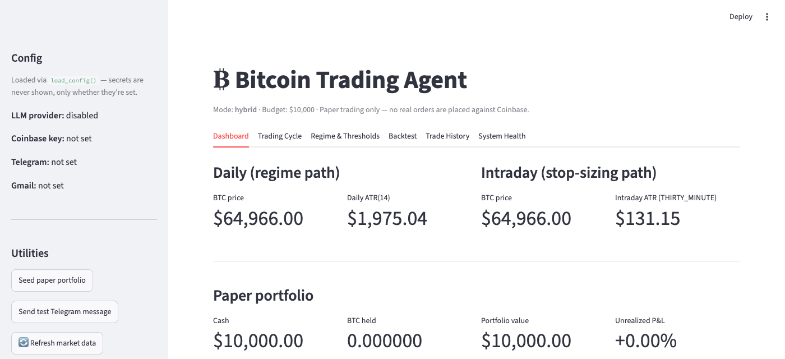
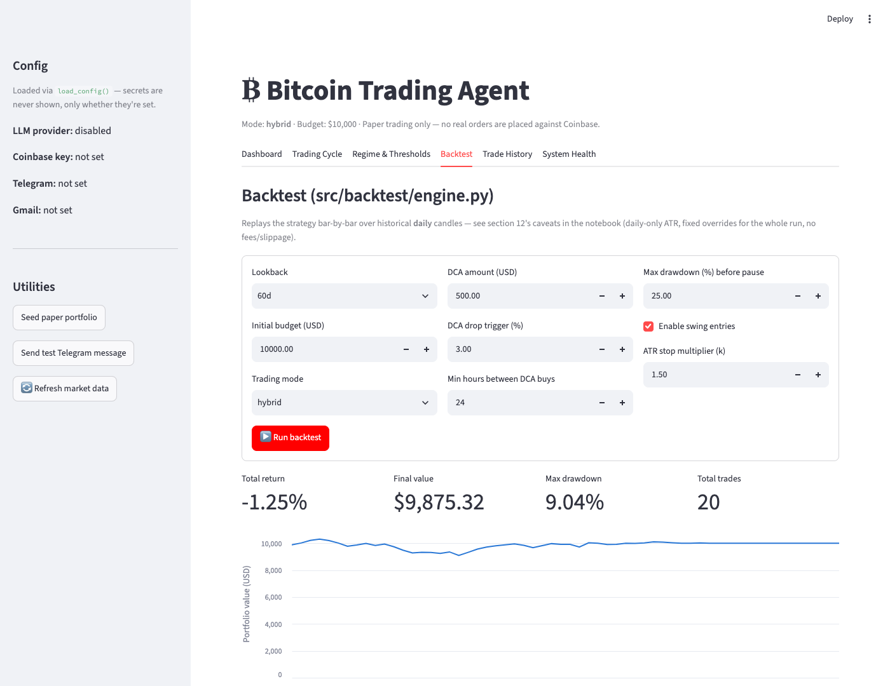
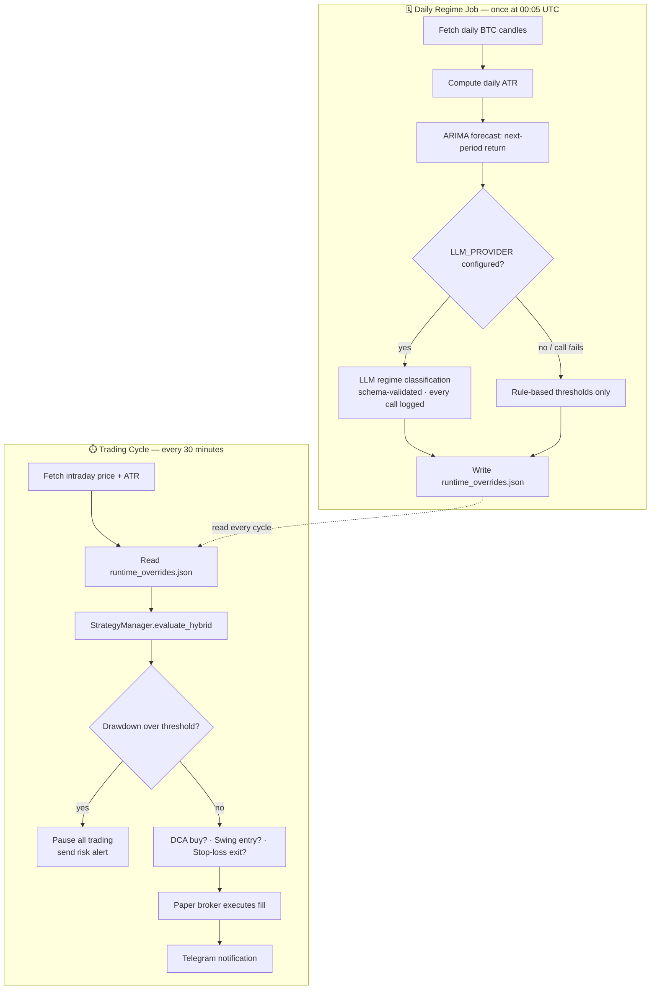
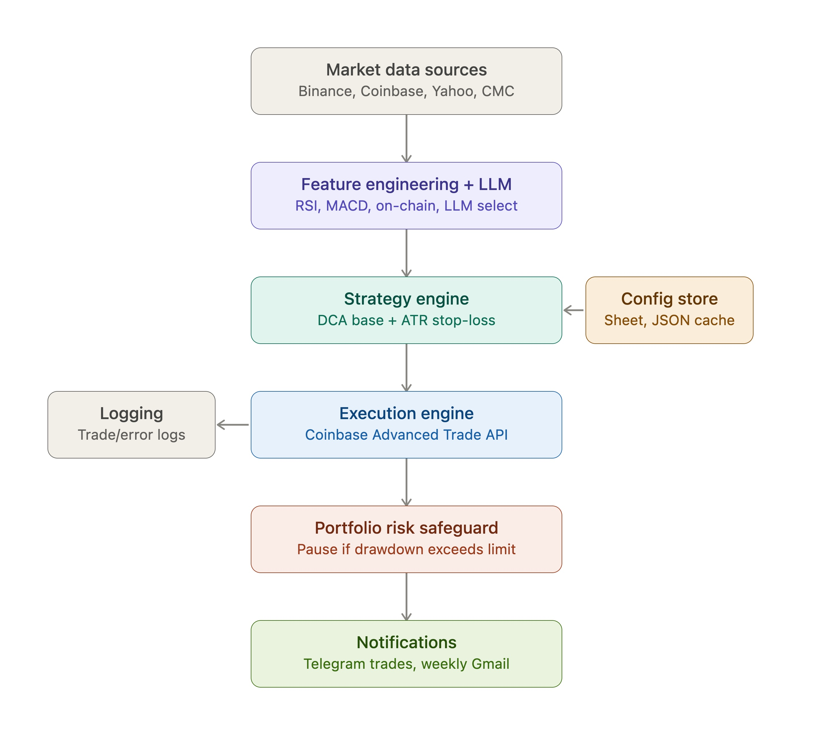

<div align="center">

# ₿ Bitcoin Trading Agent

### An autonomous, risk-first crypto trading system with hybrid rule-based strategy, statistical forecasting, and a narrowly-scoped LLM regime classifier, running 24/7 behind a containerized scheduler.

[](https://www.python.org/)
[](https://streamlit.io/)
[](https://www.docker.com/)
[](https://www.statsmodels.org/)
[](#-how-it-works)
[](#-evaluation--current-status)
[](LICENSE)

</div>

---

## 📑 Table of Contents

- [Overview](#-overview)
- [Live Interface](#-live-interface)
- [How It Works](#-how-it-works)
- [Architecture](#-architecture)
- [Key Features](#-key-features)
- [Tech Stack](#-tech-stack)
- [Project Structure](#-project-structure)
- [Getting Started](#-getting-started)
- [Evaluation & Current Status](#-evaluation--current-status)
- [For Hiring Managers & Recruiters](#-for-hiring-managers--recruiters)
- [Author](#-author)
- [License](#-license)

---

## 🧭 Overview

Most "AI trading bot" side projects either hand-wave the risk management or wire an LLM directly to order placement: a good way to lose money in a way that's hard to explain afterward. This project was built to do neither.

**Every component that touches money is deterministic and unit-testable.** The LLM's role is deliberately narrow: it classifies market regime from a handful of pre-computed indicators and can only ever *tighten* one eligibility flag, it never sizes a position, never moves a dollar amount, and never overrides a stop-loss.

The system runs a **hybrid strategy:** Dollar-Cost Averaging as the always-on base layer, ATR-sized stop-losses for opportunistic swing entries, on top of a **two-speed architecture** that separates fast execution (every 30 minutes) from slow regime analysis (once a day), with a portfolio-level drawdown circuit breaker that can pause everything if losses exceed a configurable threshold.

> **Status:** paper-trading / simulation only. No real capital is at risk in this repository's current configuration — see [Evaluation & Current Status](#-evaluation--current-status).

---

## 🖥️ Live Interface

A [Streamlit](https://streamlit.io/) control panel sits on top of the exact same modules the scheduler runs in production. No logic is duplicated between the UI and the trading engine.

<div align="center">


<sub>Live dashboard — daily & intraday price/ATR pulled from Coinbase, paper portfolio P&L</sub>
</div>

<br>

<div align="center">


<sub>One-click backtesting against historical daily candles, replaying the identical strategy code path used live</sub>
</div>

The same control panel also triggers a live trading cycle or the daily regime job on demand, browses trade history, and runs a full component health check — see [Getting Started](#-getting-started) to run it yourself.

---

## ⚙️ How It Works

The system runs two independent loops on two different clocks, each answering the question suited to its own timeframe: sizing a stop-loss from *this morning's* volatility and deciding *this week's* regime don't need the same candle size.



1. **Once a day**, the regime job pulls daily candles, computes ATR, runs an ARIMA forecast, and  if an LLM provider is configured: asks it to classify the regime from a small numeric feature snapshot. The result (rule-based or LLM-nudged) is written to a single overrides file.
2. **Every 30 minutes**, the trading cycle fetches fresh intraday price/ATR, reads whatever the regime job last wrote, and asks `StrategyManager` for a decision. A drawdown check runs first if the portfolio has lost more than its configured threshold, everything pauses and an alert fires, regardless of what the strategy would otherwise do.
3. Any resulting DCA buy, swing entry, or stop-loss exit is executed against the paper broker and reported over Telegram.
4. The **exact same `evaluate_hybrid()` call** backs the backtest engine, so validation results reflect the live trading logic, not a parallel reimplementation.

---

## 🏗️ Architecture

<div align="center">

</div>

---

## ✨ Key Features

| | |
|---|---|
| 🛡️ **Hybrid strategy with guardrails** | DCA as the always-on base layer, ATR-sized stop-losses for swing entries, and a portfolio-level drawdown circuit breaker that pauses all new activity past a configurable loss threshold. |
| ⏱️ **Two-speed architecture** | A 30-minute trading cycle decoupled from a once-daily regime/forecast recompute: each ATR calculation uses the candle granularity suited to the question it's answering. |
| 🤖 **LLM-assisted regime classification** | An optional, schema-validated call (Anthropic or OpenAI) that turns pre-computed indicators into a regime label and a logged rationale. It can only ever make the system *more* conservative  never loosen a stop, enlarge a position, or force a trade. A failed or malformed response degrades to the safe rule-based default, never to an unhandled exception. |
| 📈 **Statistical forecasting** | ARIMA-based next-period return prediction, selected via walk-forward cross-validation against ES/AR/ARIMA candidates. |
| 🔐 **Config/secrets separation** | Strategy parameters are hot-reloadable from a Google Sheet via an explicit allowlist; credentials live only in environment variables and are never reachable from the Sheet. |
| 🔔 **Full observability** | Telegram alerts on every trade and risk event, a weekly Gmail summary, and an append-only audit log of every LLM call. |
| 🧪 **Backtested against live code** | The backtest engine calls the identical `StrategyManager.evaluate_hybrid()` used in production, no parallel simulation logic to drift out of sync. |
| 🖥️ **Interactive control panel** | A Streamlit UI for live monitoring, on-demand job triggers, backtesting, and system health checks: see [Live Interface](#-live-interface). |
| 🐳 **Containerized** | Docker + docker-compose, with a persistent volume so trade history and the drawdown high-water mark survive restarts. |

---

## 🧰 Tech Stack

| Layer | Tools |
|---|---|
| Data | Coinbase Advanced Trade API, `pandas`, `requests` |
| Forecasting | `statsmodels` (ARIMA, AR, Exponential Smoothing), walk-forward CV |
| LLM integration | Anthropic / OpenAI APIs, JSON-schema response validation |
| Strategy & risk | Pure-Python rule engine, ATR-based position sizing |
| Interactive UI | `streamlit`, `altair` |
| Config | Google Sheets (`gspread`), `.env` / `python-dotenv`, allowlisted overrides |
| Scheduling | `APScheduler` |
| Notifications | Telegram Bot API, Gmail SMTP |
| Deployment | Docker, docker-compose |

---

## 📂 Project Structure

```
├── src/
│   ├── config/            # Config loading, secrets/strategy-param separation
│   ├── data/               # Daily + intraday market data and ATR
│   ├── ml/                 # Forecasting, LLM regime classifier, threshold adaptation
│   ├── strategy/            # DCA rules, hybrid strategy orchestration
│   ├── broker/              # Simulated (paper) exchange
│   ├── notify/              # Telegram + Gmail reporting
│   ├── backtest/            # Backtesting engine
│   ├── jobs/                # Daily regime recompute job
│   └── main.py              # Single trading-cycle entry point
├── scheduler.py             # 24/7 orchestration (trading cycle, daily job, weekly report)
├── streamlit_app.py         # Interactive control panel (dashboard, backtest, health check)
├── assets/screenshots/      # README images
├── Dockerfile / docker-compose.yml
├── requirements.txt
├── .env.example
└── BitTradeAgent_updated.ipynb   # Full build + test notebook, section-by-section
```

---

## 🚀 Getting Started

```bash
git clone <this-repo>
cd <this-repo>
cp .env.example .env        # fill in your own API keys / tokens
pip install -r requirements.txt

# Run a single trading cycle
python -m src.main

# Or run continuously
python scheduler.py

# Or launch the interactive control panel
streamlit run streamlit_app.py

# Or via Docker
docker compose up -d --build
docker compose logs -f
```

Leave `LLM_PROVIDER` blank in `.env` to run with rule-based thresholds only — the system behaves identically with or without an LLM configured, which was a deliberate design constraint, not an afterthought.

---

## 📊 Evaluation & Current Status

This repository trades against a **local, simulated paper broker** — `portfolio.json` and `trades.csv` on disk, not a real exchange account. That's intentional: the project prioritizes demonstrating sound architecture, risk controls, and validation methodology over live P&L, which is a poor metric to lead with for any strategy that hasn't run for months across multiple market regimes.

Known limitations, documented rather than hidden:
- ARIMA's signal is weak on ~60 days of daily data — it's one input among several, not a standalone edge.
- Paper trading doesn't model slippage, fees, or partial fills.
- The backtest engine runs on daily-only ATR, while live trading sizes swing stops from intraday ATR — a known, documented divergence (see the notebook's backtest section).

The planned next step is a real (non-paper) broker integration behind the same interface as `paper_broker.py`, so the strategy and risk logic upstream of it don't need to change.

---

## 💼 For Hiring Managers & Recruiters

If you're reviewing this as part of a portfolio, here's what it's meant to demonstrate — beyond "an agent that trades Bitcoin":

- **Time-series forecasting & model selection** — ARIMA/AR/ES compared via walk-forward cross-validation rather than a single in-sample fit, with the forecast's actual predictive weakness stated plainly rather than glossed over.
- **Applied LLM integration with real guardrails** — structured prompting, strict schema validation, one-directional risk bounds (the model can decline a trade, never authorize one outside the deterministic clamps), and graceful degradation when a call fails, instead of an unconstrained "let the model decide" pattern.
- **System design for reliability** — decoupled cadences for fast execution vs. slow regime analysis, idempotent state writes, a security-conscious config allowlist that keeps a remote Google Sheet from ever setting a secret, and defensive error handling around every external API call.
- **Rigorous validation methodology** — backtesting against the *same code path* used live, paper trading before any consideration of real capital, and an explicit accounting of what paper trading does not model.
- **Production engineering, not just a notebook** — the whole system is also a single narrated Jupyter notebook (`BitTradeAgent_updated.ipynb`) that builds every module in place, but it ships as installable packages, a container, a scheduler, and now an interactive UI — the kind of path a prototype actually takes to something operable.
- **Judgment under ambiguity** — every place this system could have taken a shortcut (an LLM with unchecked authority, a backtest that quietly diverges from live logic, a config channel with no allowlist) is the place it explicitly didn't, and that choice is documented in the code, not just asserted here.

This project is part of a broader portfolio spanning time-series forecasting, applied ML, LLM-integrated systems, and computer vision. I'm glad to walk through any design decision above in more depth — reach out via the links below.

---

## 👤 Author

**Samuel Mugisha**

- GitHub: [github.com/samuelmugisha](https://github.com/samuelmugisha)
- LinkedIn: [samuelmugishadc](https://linkedin.com/in/samuelmugishadc)

---

## 📄 License

MIT — see [LICENSE](LICENSE).
